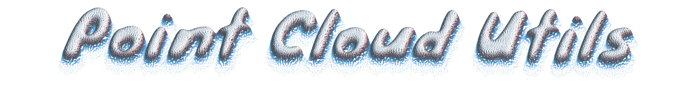

<h4 align="center"><i>A Python library for common tasks on 3D point clouds and meshes</i></h4>

--------------------------


<!-- [](https://travis-ci.com/fwilliams/point-cloud-utils) -->
<!-- [](https://ci.appveyor.com/project/fwilliams/point-cloud-utils/branch/master) -->

**Point Cloud Utils (pcu)** is a utility library providing the following functionality for 3D processing point clouds and triangle meshes. See the [Examples section](#Examples) for documentation on how to use these:
 - Utility functions for reading and writing many common mesh formats (PLY, STL, OFF, OBJ, 3DS, VRML 2.0, X3D, COLLADA).
   If it can be imported into MeshLab, we can read it!
 - A series of algorithms for generating point samples on meshes:
   - Poisson-Disk-Sampling of a mesh based on "[Parallel Poisson Disk Sampling with Spectrum Analysis on Surface](http://graphics.cs.umass.edu/pubs/sa_2010.pdf)".
   - Sampling a mesh with [Lloyd's algorithm](https://en.wikipedia.org/wiki/Lloyd%27s_algorithm).
   - Monte-Carlo sampling on a mesh.
 - Utilities for downsampling point clouds:
   - To satisfy a blue noise distribution
   - On a voxel grid
 - Closest points between a point cloud and a mesh
 - Normal estimation from point clouds and triangle meshes
 - Fast k-nearest-neighbor search between point clouds (based on [nanoflann](https://github.com/jlblancoc/nanoflann)).
 - Hausdorff distances between point-clouds.
 - Chamfer distances between point-clouds.
 - Approximate Wasserstein distances between point-clouds using the [Sinkhorn](https://arxiv.org/abs/1306.0895) method.
 - Compute signed distances between a point cloud and a mesh using [Fast Winding Numbers](https://www.dgp.toronto.edu/projects/fast-winding-numbers/)
 - Compute closest points on a mesh to a point cloud
 - Deduplicating point clouds and mesh vertices
 - Fast ray/mesh intersection using [embree](https://www.embree.org/)
 - Fast ray/surfel intersection using [embree](https://www.embree.org/)
 - Mesh smoothing
 - Making a mesh watertight (based on the [Watertight Manifold](https://github.com/hjwdzh/Manifold) algorithm)
 
<!--  -->

# Installation
<!-- ### With `conda`
Simply run:
```
conda install -c conda-forge point_cloud_utils
``` -->

```
pip install point-cloud-utils
```

<!--
### With `pip`
```
pip install git+git://github.com/fwilliams/point-cloud-utils
```
The following dependencies are required to install with `pip`:
* A C++ compiler supporting C++14 or later
* git
-->

# Examples

### List of examples
- [Loading meshes and point clouds](#loading-meshes-and-point-clouds)
- [Saving meshes and point clouds](#saving-meshes-and-point-clouds)
- [Generating blue-noise samples on a mesh with Poisson-disk sampling](#generating-blue-noise-samples-on-a-mesh-with-poisson-disk-sampling)
- [Generate random samples on a mesh](#generate-random-samples-on-a-mesh)
- [Downsample a point cloud to have a blue noise distribution](#downsample-a-point-cloud-to-have-a-blue-noise-distribution)
- [Downsample a point cloud on a voxel grid](#downsample-a-point-cloud-on-a-voxel-grid)
- [Estimating normals from a point cloud](#estimating-normals-from-a-point-cloud)
- [Approximate Wasserstein (Sinkhorn) distance between two point clouds](#approximate-wasserstein-sinkhorn-distance-between-two-point-clouds)
- [Chamfer distance between two point clouds](#chamfer-distance-between-two-point-clouds)
- [Hausdorff distance between two point clouds](#hausdorff-distance-between-two-point-clouds)
- [K-nearest-neighbors between two point clouds](#k-nearest-neighbors-between-two-point-clouds)
- [Generating point samples in the square and cube with Lloyd relaxation](#generating-point-samples-in-the-square-and-cube-with-lloyd-relaxation)
- [Compute shortest signed distances to a triangle mesh with fast winding numbers](#compute-shortest-signed-distances-to-a-triangle-mesh-with-fast-winding-numbers)
- [Compute closest points on a mesh](#compute-closest-points-on-a-mesh)
- [Deduplicating point clouds and meshes](#deduplicating-point-clouds-and-meshes)
- [Smoothing a mesh](#smoothing-a-mesh)
- [Making a mesh watertight](#making-a-mesh-watertight)
- [Ray/Mesh intersection](#ray-mesh-intersection)
- [Ray/Surfel intersection](#ray-surfel-intersection)


### Loading meshes and point clouds
Point-Cloud-Utils supports reading many common mesh formats (PLY, STL, OFF, OBJ, 3DS, VRML 2.0, X3D, COLLADA).
If it can be imported into MeshLab, we can read it! The type of file is inferred from its file extension.

If you only need a few attributes of a point cloud or mesh, the quickest way to load a mesh is using one of
the `read_mesh_*` utility functions
```python
import point_cloud_utils as pcu

# Load vertices and faces for a mesh
v, f = pcu.load_mesh_vf("path/to/mesh")

# Load vertices and per-vertex normals
v, n = pcu.load_mesh_vn("path/to/mesh")

# Load vertices, per-vertex normals, and per-vertex-colors
v, n, c = pcu.load_mesh_vnc("path/to/mesh")

# Load vertices, faces, and per-vertex normals
v, f, n = pcu.load_mesh_vfn("path/to/mesh")

# Load vertices, faces, per-vertex normals, and per-vertex colors
v, f, n, c = pcu.load_mesh_vfnc("path/to/mesh")
```

For meshes and point clouds with more complex attributes, use `load_triangle_mesh` which returns a `TriangleMesh`
object.

```python
import point_cloud_utils as pcu

# mesh is a lightweight TriangleMesh container object holding mesh vertices, faces, and their attributes.
# Any attributes which aren't loaded (because they aren't present in the file) are set to None.
# The data in TriangleMesh is layed out as follows (run help(pcu.TriangleMesh) for more details):
# TriangleMesh:
#   vertex_data:
#       positions: [V, 3]-shaped numpy array of per-vertex positions
#       normals: [V, 3]-shaped numpy array of per-vertex normals (or None)
#       texcoords: [V, 2]-shaped numpy array of per-vertex uv coordinates (or None)
#       tex_ids: [V,]-shaped numpy array of integer indices into TriangleMesh.textures indicating which texture to
#                use at this vertex (or None)
#       colors: [V, 4]-shaped numpy array of per-vertex RBGA colors in [0.0, 1.0] (or None)
#       radius: [V,]-shaped numpy array of per-vertex curvature radii (or None)
#       quality: [V,]-shaped numpy array of per-vertex quality measures (or None)
#       flags: [V,]-shaped numpy array of 32-bit integer flags per vertex (or None)
#   face_data:
#       vertex_ids: [F, 3]-shaped numpy array of integer face indices into TrianglMesh.vertex_data.positions
#       normals: [F, 3]-shaped numpy array of per-face normals (or None)
#       colors: [F, 4]-shaped numpy array of per-face RBGA colors in [0.0, 1.0] (or None)
#       quality: [F,]-shaped numpy array of per-face quality measures (or None)
#       flags: [F,]-shaped numpy array of 32-bit integer flags per face (or None)
#
#       wedge_colors: [F, 3, 4]-shaped numpy array of per-wedge RBGA colors in [0.0, 1.0] (or None)
#       wedge_normals: [F, 3, 3]-shaped numpy array of per-wedge normals (or None)
#       wedge_texcoords: [F, 3, 2]-shaped numpy array of per-wedge] uv coordinates (or None)
#       wedge_tex_ids: [F, 3]-shaped numpy array of integer indices into TriangleMesh.textures indicating which
#                      texture to use at this wedge (or None)
#   textures: A list of paths to texture image files for this mesh
#   normal_maps: A list of paths to texture image files for this mesh
mesh = pcu.load_triangle_mesh("path/to/mesh")

# You can also load a mesh directly using the TriangleMesh class
mesh = pcu.TriangleMesh("path/to/mesh")
```

For meshes and point clouds with more complex attributes, use `save_triangle_mesh` which accepts a whole host of named
arguments which control the attributes to save.
```python
# save_triangle_mesh accepts a path to save to (The type of mesh  saved is determined by the file extesion),
# an array of mesh vertices of shape [V, 3], and optional arguments specifying faces, per-mesh attributes,
# per-face attributes and per-wedge attributes:
#   filename    : Path to the mesh to save. The type of file will be determined from the file extension.
#   v           : [V, 3]-shaped numpy array of per-vertex positions
#   f           : [F, 3]-shaped numpy array of integer face indices into TrianglMesh.vertex_data.positions (or None)
#   vn          : [V, 3]-shaped numpy array of per-vertex normals (or None)
#   vt          : [V, 2]-shaped numpy array of per-vertex uv coordinates (or None)
#   vc          : [V, 4]-shaped numpy array of per-vertex RBGA colors in [0.0, 1.0] (or None)
#   vq          : [V,]-shaped numpy array of per-vertex quality measures (or None)
#   vr          : [V,]-shaped numpy array of per-vertex curvature radii (or None)
#   vti         : [V,]-shaped numpy array of integer indices into TriangleMesh.textures indicating which texture to
#                 use at this vertex (or None)
#   vflags      : [V,]-shaped numpy array of 32-bit integer flags per vertex (or None)
#   fn          : [F, 3]-shaped numpy array of per-face normals (or None)
#   fc          : [F, 4]-shaped numpy array of per-face RBGA colors in [0.0, 1.0] (or None)
#   fq          : [F,]-shaped numpy array of per-face quality measures (or None)
#   fflags      : [F,]-shaped numpy array of 32-bit integer flags per face (or None)
#   wc          : [F, 3, 4]-shaped numpy array of per-wedge RBGA colors in [0.0, 1.0] (or None)
#   wn          : [F, 3, 3]-shaped numpy array of per-wedge normals (or None)
#   wt          : [F, 3, 2]-shaped numpy array of per-wedge] uv coordinates (or None)
#   wti         : [F, 3]-shaped numpy array of integer indices into TriangleMesh.textures indicating which
#   textures    : A list of paths to texture image files for this mesh
#   normal_maps : A list of paths to texture image files for this mesh
pcu.save_triangle_mesh("path/to/mesh", v=v, f=f, vn=vertex_normals, vc=vertex_colors, fn=face_normals)

# You can also directly save a pcu.TrianglMesh object
mesh.save("path/to/mesh")
```


### Saving meshes and point clouds
Point-Cloud-Utils supports writing many common mesh formats (PLY, STL, OFF, OBJ, 3DS, VRML 2.0, X3D, COLLADA).
If it can be imported into MeshLab, we can read it! The type of file is inferred from its file extension.

If you only need to write few attributes of a point cloud or mesh, the quickest way to use the `save_mesh_*` functions
```python
import point_cloud_utils as pcu

# Assume v, f, n, c are numpy arrays
# where
#   v are the mesh vertices of shape [V, 3]
#   f are the mesh face indices into v of shape [F, 3]
#   n are the mesh per-vertex normals of shape [V, 3]
#   c are the mesh per-vertex colors of shape [V, 4]

# Save mesh vertices and faces
pcu.save_mesh_vf("path/to/mesh", v, f)

# Save mesh vertices and per-vertex normals
v, n = pcu.save_mesh_vn("path/to/mesh", v, n)

# Save mesh vertices, per-vertex normals, and per-vertex-colors
v, n, c = pcu.save_mesh_vnc("path/to/mesh", v, n, c)

# Save mesh vertices, faces, and per-vertex normals
v, f, n = pcu.save_mesh_vfn("path/to/mesh", v, f, n)

# Save vertices, faces, per-vertex normals, and per-vertex colors
v, f, n, c = pcu.save_mesh_vfnc("path/to/mesh", v, f, n, c)
```


### Generating blue-noise samples on a mesh with Poisson-disk sampling
Generate 10000 samples on a mesh with poisson disk samples
```python
import point_cloud_utils as pcu
import numpy as np

# v is a nv by 3 NumPy array of vertices
# f is an nf by 3 NumPy array of face indexes into v
# n is a nv by 3 NumPy array of vertex normals
v, f, n = pcu.load_mesh_vfn("my_model.ply")

# Generate 10000 samples on a mesh with poisson disk samples
# f_i are the face indices of each sample and bc are barycentric coordinates of the sample within a face
f_i, bc = pcu.sample_mesh_poisson_disk(v, f, n, 10000)

# Use the face indices and barycentric coordinate to compute sample positions and normals
v_poisson = pcu.interpolate_barycentric_coords(f, fi, bc, v)
n_poisson = pcu.interpolate_barycentric_coords(f, fi, bc, n)
```

Generate blue noise samples on a mesh separated by approximately 0.01 times the bounding box diagonal
```python
import point_cloud_utils as pcu
import numpy as np
# v is a nv by 3 NumPy array of vertices
# f is an nf by 3 NumPy array of face indexes into v
# n is a nv by 3 NumPy array of vertex normals
v, f, n = pcu.load_mesh_vfn("my_model.ply")


# Generate samples on a mesh with poisson disk samples seperated by approximately 0.01 times
# the length of the bounding box diagonal
bbox = np.max(v, axis=0) - np.min(v, axis=0)
bbox_diag = np.linalg.norm(bbox)

# f_i are the face indices of each sample and bc are barycentric coordinates of the sample within a face
f_i, bc = pcu.sample_mesh_poisson_disk(v, f, n, 10000)

# Use the face indices and barycentric coordinate to compute sample positions and normals
v_sampled = pcu.interpolate_barycentric_coords(f, fi, bc, v)
n_sampled = pcu.interpolate_barycentric_coords(f, fi, bc, n)
```

### Generate random samples on a mesh
```python
import point_cloud_utils as pcu
import numpy as np

# v is a nv by 3 NumPy array of vertices
# f is an nf by 3 NumPy array of face indexes into v
# n is a nv by 3 NumPy array of vertex normals
v, f, n = pcu.load_mesh_vfn("my_model.ply")

# Generate random samples on the mesh (v, f, n)
# f_idx are the face indices of each sample and bc are barycentric coordinates of the sample within a face
f_idx, bc = pcu.sample_mesh_random(v, f, num_samples=v.shape[0] * 40)

# Use the face indices and barycentric coordinate to compute sample positions and normals
v_sampled = pcu.interpolate_barycentric_coords(f, fi, bc, v)
n_sampled = pcu.interpolate_barycentric_coords(f, fi, bc, n)
```

### Downsample a point cloud to have a blue noise distribution
```python
import point_cloud_utils as pcu
import numpy as np

# v is a nv by 3 NumPy array of vertices
# n is a nv by 3 NumPy array of vertex normals
v, n = pcu.load_mesh_vn("my_model.ply")

# Downsample a point cloud by approximately 50% so that the sampled points approximately
# follow a blue noise distribution
# idx is an array of integer indices into v indicating which samples to keep
idx = pcu.downsample_point_cloud_poisson_disk(v, num_samples=int(0.5*v.shape[0]))

# Use the indices to get the sample positions and normals
v_sampled = v[idx]
n_sampled = n[idx]
```

### Downsample a point cloud on a voxel grid
Simple downsampling within the bounding box of a point cloud
```python
import point_cloud_utils as pcu
import numpy as np

# v is a nv by 3 NumPy array of vertices
# n is a nv by 3 NumPy array of vertex normals
# n is a nv by 4 NumPy array of vertex colors
v, n, c = pcu.load_mesh_vnc("my_model.ply")

# We'll use a voxel grid with 128 voxels per axis
num_voxels_per_axis = 128

# Size of the axis aligned bounding box of the point cloud
bbox_size = v.max(0) - v.min(0)

# The size per-axis of a single voxel
sizeof_voxel = bbox_size / num_voxels_per_axis

# Downsample a point cloud on a voxel grid so there is at most one point per voxel.
# Multiple points, normals, and colors within a voxel cell are averaged together.
v_sampled, n_sampled, c_sampled = pcu.downsample_point_cloud_voxel_grid(sizeof_voxel, v, n, c)
```

Specifying the location of the voxel grid in space (e.g. to only consider points wihtin a sub-region of the point cloud)
```python
import point_cloud_utils as pcu
import numpy as np

# v is a nv by 3 NumPy array of vertices
# n is a nv by 3 NumPy array of vertex normals
# n is a nv by 4 NumPy array of vertex colors
v, n, c = pcu.load_mesh_vnc("my_model.ply")

# We'll use a voxel grid with 128 voxels per axis
num_voxels_per_axis = 128

# Size of the axis aligned bounding box of the point cloud
bbox_size = v.max(0) - v.min(0)

# Let's say we only want to consider points in the top right corner of the bounding box
domain_min = v.min(0) + bbox_size / 2.0
domain_max = v.min(0) + bbox_size

# The size per-axis of a single voxel
sizeof_voxel = bbox_size / num_voxels_per_axis

# Downsample a point cloud on a voxel grid so there is at most one point per voxel.
# Multiple points, normals, and colors within a voxel cell are averaged together.
# min_bound and max_bound specify a bounding box in which we will downsample points
v_sampled, n_sampled, c_sampled = pcu.downsample_point_cloud_voxel_grid(sizeof_voxel, v, n, c,
                                                                        min_bound=domain_min, max_bound=domain_max)
```


Discarding voxels with too few points
```python
import point_cloud_utils as pcu
import numpy as np

# v is a nv by 3 NumPy array of vertices
# n is a nv by 3 NumPy array of vertex normals
# n is a nv by 4 NumPy array of vertex colors
v, n, c = pcu.load_mesh_vnc("my_model.ply")

# We'll use a voxel grid with 128 voxels per axis
num_voxels_per_axis = 128

# Size of the axis aligned bounding box of the point cloud
bbox_size = v.max(0) - v.min(0)

# The size per-axis of a single voxel
sizeof_voxel = bbox_size / num_voxels_per_axis

# We will throw away points within voxel cells containing fewer than 3 points
min_points_per_voxel = 3

# Downsample a point cloud on a voxel grid so there is at most one point per voxel.
# Multiple points, normals, and colors within a voxel cell are averaged together.
v_sampled, n_sampled, c_sampled = pcu.downsample_point_cloud_voxel_grid(sizeof_voxel, v, n, c,
                                                                        min_points_per_voxel=min_points_per_voxel)
```

### Compute closest points on a mesh
```python
import point_cloud_utils as pcu

# v is a nv by 3 NumPy array of vertices
v, f = pcu.load_mesh_vf("my_model.ply")

# Generate 1000 random query points. We will find the closest point on the mesh for each of these
p = np.random.rand(1000, 3)

# For each query point, find the closest point on the mesh.
# Here:
#  - d is an array of closest distances for each query point with shape (1000,)
#  - fi is an array of closest face indices for each point with shape (1000,)
#  - bc is an array of barycentric coordinates within each face (shape (1000, 3)
#    of the closest point for each query point
d, fi, bc = pcu.closest_points_on_mesh(p, v, f)

# Convert barycentric coordinates to 3D positions
closest_points = pcu.interpolate_barycentric_coords(f, fi, bc, v)
```

### Estimating normals from a point cloud
```python
import point_cloud_utils as pcu

# v is a nv by 3 NumPy array of vertices
v = pcu.load_mesh_v("my_model.ply")

# Estimate a normal at each point (row of v) using its 16 nearest neighbors
n = pcu.estimate_point_cloud_normals_knn(v, 16)

# Estimate a normal at each point (row of v) using its neighbors within a 0.1-radius ball
n = pcu.estimate_point_cloud_normals_ball(v, 0.1)
```


### Approximate Wasserstein (Sinkhorn) distance between two point clouds
```python
import point_cloud_utils as pcu
import numpy as np

# a and b are arrays where each row contains a point
# Note that the point sets can have different sizes (e.g [100, 3], [111, 3])
a = np.random.rand(100, 3)
b = np.random.rand(100, 3)

# M is a 100x100 array where each entry  (i, j) is the squared distance between point a[i, :] and b[j, :]
M = pcu.pairwise_distances(a, b)

# w_a and w_b are masses assigned to each point. In this case each point is weighted equally.
w_a = np.ones(a.shape[0])
w_b = np.ones(b.shape[0])

# P is the transport matrix between a and b, eps is a regularization parameter, smaller epsilons lead to
# better approximation of the true Wasserstein distance at the expense of slower convergence
P = pcu.sinkhorn(w_a, w_b, M, eps=1e-3)

# To get the distance as a number just compute the frobenius inner product <M, P>
sinkhorn_dist = (M*P).sum()
```

### Chamfer distance between two point clouds
```python
import point_cloud_utils as pcu
import numpy as np

# a and b are arrays where each row contains a point
# Note that the point sets can have different sizes (e.g [100, 3], [111, 3])
a = np.random.rand(100, 3)
b = np.random.rand(100, 3)

chamfer_dist = pcu.chamfer_distance(a, b)
```

### Hausdorff distance between two point clouds
```python
import point_cloud_utils as pcu
import numpy as np

# Generate two random point sets
a = np.random.rand(1000, 3)
b = np.random.rand(500, 3)

# Compute one-sided squared Hausdorff distances
hausdorff_a_to_b = pcu.one_sided_hausdorff_distance(a, b)
hausdorff_b_to_a = pcu.one_sided_hausdorff_distance(b, a)

# Take a max of the one sided squared  distances to get the two sided Hausdorff distance
hausdorff_dist = pcu.hausdorff_distance(a, b)

# Find the index pairs of the two points with maximum shortest distancce
hausdorff_b_to_a, idx_b, idx_a = pcu.one_sided_hausdorff_distance(b, a, return_index=True)
assert np.abs(np.sum((a[idx_a] - b[idx_b])**2) - hausdorff_b_to_a**2) < 1e-5, "These values should be almost equal"

# Find the index pairs of the two points with maximum shortest distancce
hausdorff_dist, idx_b, idx_a = pcu.hausdorff_distance(b, a, return_index=True)
assert np.abs(np.sum((a[idx_a] - b[idx_b])**2) - hausdorff_dist**2) < 1e-5, "These values should be almost equal"

```

### K-nearest-neighbors between two point clouds
```python
import point_cloud_utils as pcu
import numpy as np

# Generate two random point sets
a = np.random.rand(1000, 3)
b = np.random.rand(500, 3)

# dists_a_to_b is of shape (a.shape[0],) and contains the shortest squared distance
# between each point in a and the points in b
# corrs_a_to_b is of shape (a.shape[0],) and contains the index into b of the
# closest point for each point in a
dists_a_to_b, corrs_a_to_b = pcu.shortest_distance_pairs(a, b)
```

### Generating point samples in the square and cube with Lloyd relaxation
```python
import point_cloud_utils as pcu

# v is a nv by 3 NumPy array of vertices
# f is an nf by 3 NumPy array of face indexes into v
v, f = pcu.load_mesh_vf("my_model.ply")

# Generate 1000 points on the mesh with Lloyd's algorithm
samples = pcu.sample_mesh_lloyd(v, f, 1000)

# Generate 100 points on the unit square with Lloyd's algorithm
samples_2d = pcu.lloyd_2d(100)

# Generate 100 points on the unit cube with Lloyd's algorithm
samples_3d = pcu.lloyd_3d(100)
```

### Compute shortest signed distances to a triangle mesh with [fast winding numbers](https://www.dgp.toronto.edu/projects/fast-winding-numbers/)
```python
import point_cloud_utils as pcu

# v is a nv by 3 NumPy array of vertices
# f is an nf by 3 NumPy array of face indexes into v
v, f = pcu.load_mesh_vf("my_model.ply")

# Generate 1000 points in the volume around the mesh. We'll compute the signed distance to the
# mesh at each of these points
pts = np.random.rand(1000, 3) * (v.max(0) - v.min(0)) + v.min(0)

# Compute the sdf, the index of the closest face in the mesh, and the barycentric coordinates of
# closest point on the mesh, for each point in pts
sdfs, face_ids, barycentric_coords = pcu.signed_distance_to_mesh(pts, v, f)
```


### Deduplicating Point Clouds and Meshes
#### Point Clouds:
```python
import point_cloud_utils as pcu

# p is a (n, 3)-shaped array of points (one per row)
# p is a (n, 3)-shaped array of normals at each point
p, n = pcu.load_mesh_vn("my_pcloud.ply")

# Treat any points closer than 1e-7 apart as the same point
# idx_i is an array of indices such that p_dedup = p[idx_i]
# idx_j is an array of indices such that p = p_dedup[idx_j]
p_dedup, idx_i, idx_j  = deduplicate_point_cloud(p, 1e-7)

# Use idx_i to deduplicate the normals
n_dedup = n[idx_i]
```

#### Meshes:
```python
# v is a (nv, 3)-shaped NumPy array of vertices
# f is an (nf, 3)-shaped NumPy array of face indexes into v
# c is a (nv, 4)-shaped numpy array of per-vertex colors
v, f, c = pcu.load_mesh_vfc("my_model.ply")

# Treat any points closer than 1e-7 apart as the same point
# idx_i is an array of indices such that v_dedup = v[idx_i]
# idx_j is an array of indices such that v = v_dedup[idx_j]
v_dedup, f_dedup, idx_i, idx_j = pcu.deduplicate_mesh_vertices(v, f, 1e-7)

# Use idx_i to deduplicate the colors
c_dedup = c[idx_i]
```


### Smoothing a Mesh
```python
import point_cloud_utils as pcu

# v is a nv by 3 NumPy array of vertices
# f is an nf by 3 NumPy array of face indexes into v
v, f = pcu.load_mesh_vf("my_model.ply")

num_iters = 3  # Number of smoothing iterations
use_cotan_weights = True  # Whether to use cotangent weighted laplacian

# vsmooth contains the vertices of the smoothed mesh (the new mesh has the same face indices f)
vsmooth = pcu.laplacian_smooth_mesh(v, f, num_iters, use_cotan_weights=use_cotan_weights)
```


### Making a Mesh Watertight
```python
import point_cloud_utils as pcu

# v is a nv by 3 NumPy array of vertices
# f is an nf by 3 NumPy array of face indexes into v
v, f = pcu.load_mesh_vf("my_model.ply")

# Optional resolution parameter (default is 20_000).
# See https://github.com/hjwdzh/Manifold for details
resolution = 20_000  
v_watertight, f_watertight = pcu.make_mesh_watertight(v, f, resolution=resolution)
```


# Ray/Mesh Intersection
```python
import point_cloud_utils as pcu
import numpy as np

# v is a #v by 3 NumPy array of vertices
# f is an #f by 3 NumPy array of face indexes into v
# c is a #v by 4 array of vertex colors
v, f, c = pcu.load_mesh_vfc("my_model.ply")

# Generate rays on an image grid
uv = np.stack([a.ravel() for a in np.mgrid[-1:1:128j, -1.:1.:128j]], axis=-1)
ray_d = np.concatenate([uv, np.ones([uv.shape[0], 1])], axis=-1)
ray_d = ray_d / np.linalg.norm(ray_d, axis=-1, keepdims=True)
ray_o = np.array([[2.5, 0, -55.0] for _ in range(d.shape[0])])

# Intersect rays with geometry
intersector = pcu.RayMeshIntersector(v, f)

# fid is the index of each face intersected (-1 for ray miss)
# bc are the barycentric coordinates of each intersected ray
# t are the distances from the ray origin to the intersection for each ray (inf for ray miss)
fid, bc, t = intersector.intersect_rays(ray_o, ray_d)

# Get intersection positions and colors by interpolating on the faces
hit_mask = np.isfinite(t)
hit_pos = pcu.interpolate_barycentric_coords(f, fid[hit_mask], bc[hit_mask], v)
hit_clr = pcu.interpolate_barycentric_coords(f, fid[hit_mask], bc[hit_mask], c)
```

# Ray/Surfel Intersection
```python
import point_cloud_utils as pcu
import numpy as np

# v is a #v by 3 NumPy array of vertices
# n is a #v by 3 NumPy array of vertex normals
v, n = pcu.load_mesh_vn("my_model.ply")

# Generate rays on an image grid
uv = np.stack([a.ravel() for a in np.mgrid[-1:1:128j, -1.:1.:128j]], axis=-1)
ray_d = np.concatenate([uv, np.ones([uv.shape[0], 1])], axis=-1)
ray_d = ray_d / np.linalg.norm(ray_d, axis=-1, keepdims=True)
ray_o = np.array([[2.5, 0, -55.0] for _ in range(d.shape[0])])

# Intersect rays with surfels with fixed radius 0.55
intersector = pcu.RaySurfelIntersector(v, n, r=0.55)

# pid is the index of each point intersected by a ray
# t are the distances from the ray origin to the intersection for each ray (inf for ray miss)
pid, t = intersector.intersect_rays(ray_o, ray_d)

# Get points intersected by rays
hit_mask = pid >= 0
intersected_points = v[pid[hit_mask]]
```
